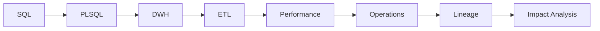

# Oracle DB Developer Handbook

This is a practical technical reference for Oracle database and data development. The C01–C40 chapters retain detailed explanations, Oracle examples, mental models, operational scenarios and **Questions and answers** across SQL, PL/SQL, architecture, performance, DWH and data engineering.

## Use it as a reference

You can read the handbook from C01 to C40, but it is also designed for topic-based lookup. Use the sidebar to jump directly to SQL and PL/SQL, optimizer and execution plans, indexes and statistics, Oracle architecture, tuning and diagnostics, security and connectivity, ETL, CDC, batch processing, reconciliation, banking data, lineage or impact analysis.

## Who this is for

The handbook is intended for Oracle developers, data developers, database-focused technical analysts and data engineers who need a detailed reference that connects Oracle mechanics with DWH and enterprise data-processing scenarios.

## How to use it

Read each chapter in order or use the eight subject groups in the sidebar. Run the SQL in a laboratory PDB such as `FREEPDB1`, inspect actual execution behaviour, and use the final **Questions and answers** section to check your understanding.

Every chapter follows the same learning rhythm: concepts, explanations, Oracle examples, mental models, practical scenarios, checks and **Questions and answers**.
