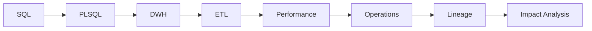

# Oracle Data Developer Handbook

This is the complete English web edition of the original C01–C40 Oracle Data Developer course. The chapter pages retain the detailed explanations, Oracle examples, mental models, operational scenarios and technical questions from the source conversations.

## How to use it

Read each chapter in order or use the eight subject groups in the sidebar. Run the SQL in a laboratory PDB such as `FREEPDB1`, inspect actual execution behaviour, and use the final **Questions and answers** section to check your understanding.

Every chapter follows the same learning rhythm: concepts, explanations, Oracle examples, mental models, practical scenarios, checks and **Questions and answers**.
